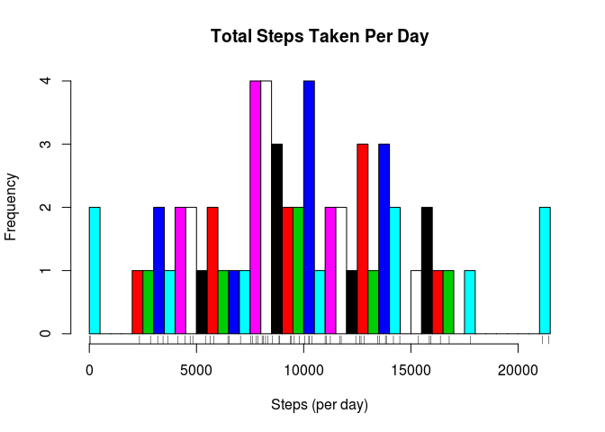
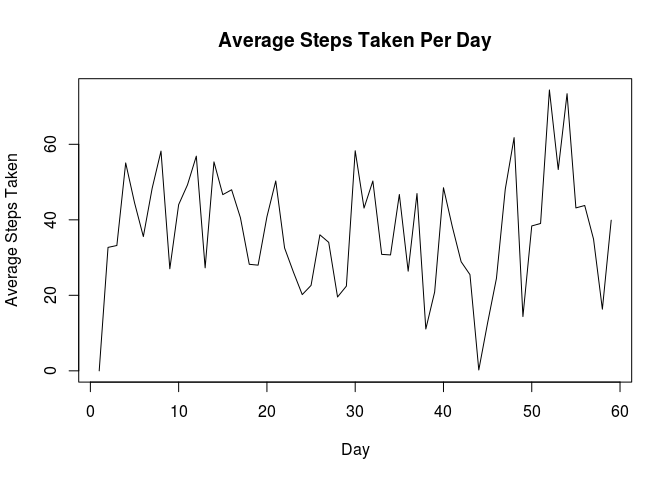
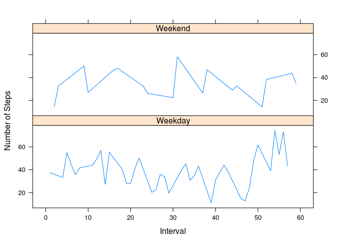

# Reproducible Research: Peer Assessment 1
## Anciliary Function

I wrote a classifier for the time series indexes that will be used
to separate each day into `weekend`/`weekday` factor groups

```r
#Use custom function to apply type-of-day factor to a data frame
classify_week_day <-function(day_of_week) {
  if (day_of_week==6 | day_of_week == 0) {
    'Weekend'
  }
  else {
    'Weekday'
  }
}
```

## Loading and preprocessing the data

I took the original data and extracted a subset to use for the time series data that will be
needed for the aggregate calculations. I also went ahead and created aggregate vectors.


```r
#Load the necessary libraries
library(xts)
```

```
## Loading required package: zoo
```

```
## 
## Attaching package: 'zoo'
```

```
## The following objects are masked from 'package:base':
## 
##     as.Date, as.Date.numeric
```

```r
library(ggplot2)
library(lattice)

#Unzip the compressed data source
unzip('./activity.zip')

#Load the csv data from the activity data file
raw_step_data <- read.csv('./activity.csv',header=TRUE)

#Prep the date column so that it can be used for time series operations
raw_step_data$date <- as.Date(raw_step_data$date)

#Add a day-of-week column to use for coloring
raw_step_data$day_of_week <- as.POSIXlt(raw_step_data$date,tz="UTC")$wday

#combine the intervals with the dates for each step data item to prepare for time
#series calculations
raw_step_data$date <- as.POSIXct(raw_step_data$interval*60,origin=raw_step_data$date,tz="UTC")

#Extract a subset of the step data so that time-series manipulation can be performed
filtered_step_data <- subset(raw_step_data,!is.na(raw_step_data$steps))

#Build time series data structure which will be used for daily statistics (min,max,mean)
xts.ts <- xts(filtered_step_data$steps,filtered_step_data$date)

#Perform all step data aggregate calculations
total_steps_per_day <- apply.daily(xts.ts,sum)
average_steps_per_day <- apply.daily(xts.ts,mean)
min_steps_per_day <- apply.daily(xts.ts,min)
max_steps_per_day <- apply.daily(xts.ts,max)

#Construct new data frame that will hold all time-series aggregates
aggregate_step_data <- data.frame(cbind(seq(1,length(total_steps_per_day)),
                                  as.Date(index(total_steps_per_day)),
                                  as.numeric(total_steps_per_day),
                                  as.numeric(min_steps_per_day),
                                  as.numeric(max_steps_per_day),
                                  as.numeric(average_steps_per_day)))
#Add sensible column names
names(aggregate_step_data) <- c("day","date","daily_total","daily_min","daily_max","daily_average")
#Ensure date is in proper form for day-of-week population
aggregate_step_data$date <- as.Date(aggregate_step_data$date)
aggregate_step_data$day_of_week<-as.POSIXlt(as.Date(aggregate_step_data$day))$wday
```
### Which data frame will be used for graphs and further exploratory analysis?  
I will use the newly constructed data frame , aggregate_step_data:


```r
   str(aggregate_step_data)  
```

```
## 'data.frame':	59 obs. of  7 variables:
##  $ day          : num  1 2 3 4 5 6 7 8 9 10 ...
##  $ date         : Date, format: "2012-10-02" "2012-10-03" ...
##  $ daily_total  : num  0 9416 9560 15859 12830 ...
##  $ daily_min    : num  0 0 0 0 0 0 0 0 0 0 ...
##  $ daily_max    : num  0 613 522 555 519 526 523 748 413 748 ...
##  $ daily_average: num  0 32.7 33.2 55.1 44.5 ...
##  $ day_of_week  : int  5 6 0 1 2 3 4 5 6 0 ...
```

```r
   summary(aggregate_step_data)  
```

```
##       day            date             daily_total      daily_min
##  Min.   : 1.0   Min.   :2012-10-02   Min.   :    0   Min.   :0  
##  1st Qu.:15.5   1st Qu.:2012-10-16   1st Qu.: 6490   1st Qu.:0  
##  Median :30.0   Median :2012-10-31   Median : 9416   Median :0  
##  Mean   :30.0   Mean   :2012-10-31   Mean   : 9671   Mean   :0  
##  3rd Qu.:44.5   3rd Qu.:2012-11-15   3rd Qu.:12752   3rd Qu.:0  
##  Max.   :59.0   Max.   :2012-11-30   Max.   :21424   Max.   :0  
##    daily_max     daily_average    day_of_week   
##  Min.   :  0.0   Min.   : 0.00   Min.   :0.000  
##  1st Qu.:507.5   1st Qu.:26.72   1st Qu.:1.000  
##  Median :544.0   Median :38.19   Median :3.000  
##  Mean   :582.3   Mean   :37.08   Mean   :3.034  
##  3rd Qu.:750.5   3rd Qu.:48.04   3rd Qu.:5.000  
##  Max.   :806.0   Max.   :74.39   Max.   :6.000
```


## What is mean total number of steps taken per day?

###Calculate the total number of steps taken per day
I stored the sum of steps per day in total_steps_per_day:

```r
  aggregate_step_data$daily_total
```

```
##  [1]     0  9416  9560 15859 12830 10242  5416 10242  7786 12675 14185
## [12] 16375  7857 15938 13440 13812 11673  8126  8061 11751 14482  9372
## [23]  7536  5814  6518 10376  9799  5633  6463 16786  4828  8849  8884
## [34]  3438  8220  7603 13523  3190  2339  8535 10998  8322  2854    41
## [45]  3661  7052 13857 17787  4140 11052 11242 21424 15353 21138 12428
## [56] 12611 10045  4703  4468
```

###Make a histogram of the total number of steps taken each day
I leveraged the data from total_steps_per_day to generate the total steps per day histogram:

```r
  hist(aggregate_step_data$daily_total,breaks=50,
       xlab="Steps (per day)",main="Total Steps Taken Per Day",
       col=aggregate_step_data$day_of_week)
rug(aggregate_step_data$daily_total)
```

<!-- -->

###Calculate and report the mean and median of the total number of steps taken per day
I leveraged the data from aggregate_step_data to calculate the mean and mode for steps taken per
day. 

```r
  mean(aggregate_step_data$daily_total)  
```

```
## [1] 9671.322
```

```r
  median(aggregate_step_data$daily_total)  
```

```
## [1] 9416
```


## What is the average daily activity pattern?

### Make a time series plot (i.e. type = "l") of the 5-minute interval (x-axis) and the average number of steps taken, averaged across all days (y-axis)

I approached this question by taking the 61 days of averages , with each average coming from a particular day , and 
generated a time-series plot of that information:


```r
  plot(seq(1,59),aggregate_step_data$daily_average,
      type="l",xlab="Day",ylab="Average Steps Taken",
      main="Average Steps Taken Per Day")
```

<!-- -->

### Which 5-minute interval, on average across all the days in the dataset, contains the maximum number of steps?

I approached this question by looking at the time-series plot from the previous graph and zeroing in on the day
that had the highest average. Judging by the graph , this looks to be an interval from day 52. I double-checked 
this against the actual average data:


```r
  aggregate_step_data$daily_average
```

```
##  [1]  0.0000000 32.6944444 33.1944444 55.0659722 44.5486111 35.5625000
##  [7] 48.3571429 58.1931818 27.0347222 44.0104167 49.2534722 56.8576389
## [13] 27.2812500 55.3402778 46.6666667 47.9583333 40.5312500 28.2152778
## [19] 27.9895833 40.8020833 50.2847222 32.5416667 26.1666667 20.1875000
## [25] 22.6319444 36.0277778 34.0243056 19.5590278 22.4409722 58.2847222
## [31] 43.1071429 50.2784091 30.8472222 30.6964286 46.7045455 26.3993056
## [37] 46.9548611 11.0763889 20.8839286 48.4943182 38.1875000 28.8958333
## [43] 25.4821429  0.2329545 12.7118056 24.4861111 48.1145833 61.7604167
## [49] 14.3750000 38.3750000 39.0347222 74.3888889 53.3090278 73.3958333
## [55] 43.1527778 43.7881944 34.8784722 16.3298611 39.8928571
```

```r
  average_steps_per_day[52]
```

```
## Warning: timezone of object (UTC) is different than current timezone ().
```

```
##                         [,1]
## 2012-11-23 23:55:00 74.38889
```

Next, I grabbed the actual time data from that day to locate the 5-minute interval that had the max value on that day:


```r
  xts.ts['2012-11-23']
```

```
## Warning: timezone of object (UTC) is different than current timezone ().
```

```
##                     [,1]
## 2012-11-23 00:00:00    0
## 2012-11-23 00:00:00    0
## 2012-11-23 00:05:00   39
## 2012-11-23 00:05:00    0
## 2012-11-23 00:10:00   15
## 2012-11-23 00:10:00    0
## 2012-11-23 00:15:00   41
## 2012-11-23 00:15:00    0
## 2012-11-23 00:20:00    0
## 2012-11-23 00:25:00    0
## 2012-11-23 00:30:00    0
## 2012-11-23 00:35:00    0
## 2012-11-23 00:40:00    0
## 2012-11-23 00:45:00    0
## 2012-11-23 00:50:00    0
## 2012-11-23 00:55:00    0
## 2012-11-23 01:00:00    0
## 2012-11-23 01:05:00    0
## 2012-11-23 01:10:00    0
## 2012-11-23 01:15:00    0
## 2012-11-23 01:20:00    0
## 2012-11-23 01:25:00    0
## 2012-11-23 01:30:00    0
## 2012-11-23 01:35:00  291
## 2012-11-23 01:40:00  520
## 2012-11-23 01:40:00    0
## 2012-11-23 01:45:00  532
## 2012-11-23 01:45:00    0
## 2012-11-23 01:50:00  504
## 2012-11-23 01:50:00    0
## 2012-11-23 01:55:00  504
## 2012-11-23 01:55:00    0
## 2012-11-23 02:00:00    0
## 2012-11-23 02:05:00    0
## 2012-11-23 02:10:00    0
## 2012-11-23 02:15:00    0
## 2012-11-23 02:20:00    0
## 2012-11-23 02:25:00    0
## 2012-11-23 02:30:00    0
## 2012-11-23 02:35:00    0
## 2012-11-23 02:40:00  533
## 2012-11-23 02:45:00  522
## 2012-11-23 02:50:00  546
## 2012-11-23 02:55:00  546
## 2012-11-23 03:00:00  541
## 2012-11-23 03:05:00  546
## 2012-11-23 03:10:00  510
## 2012-11-23 03:15:00  468
## 2012-11-23 03:20:00  493
## 2012-11-23 03:20:00    0
## 2012-11-23 03:25:00  511
## 2012-11-23 03:25:00    0
## 2012-11-23 03:30:00  142
## 2012-11-23 03:30:00    0
## 2012-11-23 03:35:00   45
## 2012-11-23 03:35:00    0
## 2012-11-23 03:40:00    0
## 2012-11-23 03:45:00    0
## 2012-11-23 03:50:00    0
## 2012-11-23 03:55:00    0
## 2012-11-23 04:00:00    0
## 2012-11-23 04:05:00    0
## 2012-11-23 04:10:00    0
## 2012-11-23 04:15:00    0
## 2012-11-23 04:20:00   42
## 2012-11-23 04:25:00   71
## 2012-11-23 04:30:00   74
## 2012-11-23 04:35:00   79
## 2012-11-23 04:40:00  201
## 2012-11-23 04:45:00   71
## 2012-11-23 04:50:00   12
## 2012-11-23 04:55:00    0
## 2012-11-23 05:00:00   28
## 2012-11-23 05:00:00    0
## 2012-11-23 05:05:00   15
## 2012-11-23 05:05:00    0
## 2012-11-23 05:10:00    0
## 2012-11-23 05:10:00    0
## 2012-11-23 05:15:00    0
## 2012-11-23 05:15:00    0
## 2012-11-23 05:20:00    0
## 2012-11-23 05:25:00    0
## 2012-11-23 05:30:00    0
## 2012-11-23 05:35:00    0
## 2012-11-23 05:40:00    0
## 2012-11-23 05:45:00    0
## 2012-11-23 05:50:00    0
## 2012-11-23 05:55:00    0
## 2012-11-23 06:00:00    0
## 2012-11-23 06:05:00   10
## 2012-11-23 06:10:00   46
## 2012-11-23 06:15:00   15
## 2012-11-23 06:20:00   32
## 2012-11-23 06:25:00    0
## 2012-11-23 06:30:00    0
## 2012-11-23 06:35:00   44
## 2012-11-23 06:40:00  113
## 2012-11-23 06:40:00    0
## 2012-11-23 06:45:00  425
## 2012-11-23 06:45:00    0
## 2012-11-23 06:50:00  468
## 2012-11-23 06:50:00    0
## 2012-11-23 06:55:00  475
## 2012-11-23 06:55:00    0
## 2012-11-23 07:00:00    0
## 2012-11-23 07:05:00    0
## 2012-11-23 07:10:00    0
## 2012-11-23 07:15:00    0
## 2012-11-23 07:20:00    0
## 2012-11-23 07:25:00    0
## 2012-11-23 07:30:00    0
## 2012-11-23 07:35:00    0
## 2012-11-23 07:40:00  439
## 2012-11-23 07:45:00  484
## 2012-11-23 07:50:00  380
## 2012-11-23 07:55:00   68
## 2012-11-23 08:00:00   65
## 2012-11-23 08:05:00   24
## 2012-11-23 08:10:00  250
## 2012-11-23 08:15:00  567
## 2012-11-23 08:20:00  136
## 2012-11-23 08:20:00    0
## 2012-11-23 08:25:00   33
## 2012-11-23 08:25:00    0
## 2012-11-23 08:30:00    0
## 2012-11-23 08:30:00    0
## 2012-11-23 08:35:00   28
## 2012-11-23 08:35:00    0
## 2012-11-23 08:40:00    0
## 2012-11-23 08:45:00    0
## 2012-11-23 08:50:00    0
## 2012-11-23 08:55:00    0
## 2012-11-23 09:00:00    0
## 2012-11-23 09:05:00    0
## 2012-11-23 09:10:00    0
## 2012-11-23 09:15:00    0
## 2012-11-23 09:20:00    0
## 2012-11-23 09:25:00    0
## 2012-11-23 09:30:00    8
## 2012-11-23 09:35:00   36
## 2012-11-23 09:40:00    0
## 2012-11-23 09:45:00    0
## 2012-11-23 09:50:00    0
## 2012-11-23 09:55:00    0
## 2012-11-23 10:00:00   38
## 2012-11-23 10:00:00    0
## 2012-11-23 10:05:00    0
## 2012-11-23 10:05:00    0
## 2012-11-23 10:10:00    0
## 2012-11-23 10:10:00    0
## 2012-11-23 10:15:00    0
## 2012-11-23 10:15:00    0
## 2012-11-23 10:20:00    0
## 2012-11-23 10:25:00    0
## 2012-11-23 10:30:00    0
## 2012-11-23 10:35:00    0
## 2012-11-23 10:40:00    0
## 2012-11-23 10:45:00    0
## 2012-11-23 10:50:00    0
## 2012-11-23 10:55:00    0
## 2012-11-23 11:00:00    0
## 2012-11-23 11:05:00    0
## 2012-11-23 11:10:00    0
## 2012-11-23 11:15:00    0
## 2012-11-23 11:20:00    0
## 2012-11-23 11:25:00    0
## 2012-11-23 11:30:00    0
## 2012-11-23 11:35:00    0
## 2012-11-23 11:40:00    0
## 2012-11-23 11:40:00    0
## 2012-11-23 11:45:00    0
## 2012-11-23 11:45:00    0
## 2012-11-23 11:50:00    0
## 2012-11-23 11:50:00    0
## 2012-11-23 11:55:00    0
## 2012-11-23 11:55:00    0
## 2012-11-23 12:00:00    0
## 2012-11-23 12:05:00    0
## 2012-11-23 12:10:00    0
## 2012-11-23 12:15:00    0
## 2012-11-23 12:20:00    0
## 2012-11-23 12:25:00    0
## 2012-11-23 12:30:00    0
## 2012-11-23 12:35:00    0
## 2012-11-23 12:40:00    0
## 2012-11-23 12:45:00    0
## 2012-11-23 12:50:00    0
## 2012-11-23 12:55:00    0
## 2012-11-23 13:00:00    0
## 2012-11-23 13:05:00    0
## 2012-11-23 13:10:00    0
## 2012-11-23 13:15:00    0
## 2012-11-23 13:20:00    0
## 2012-11-23 13:20:00    0
## 2012-11-23 13:25:00    0
## 2012-11-23 13:25:00    0
## 2012-11-23 13:30:00    0
## 2012-11-23 13:30:00    0
## 2012-11-23 13:35:00    0
## 2012-11-23 13:35:00    0
## 2012-11-23 13:40:00    0
## 2012-11-23 13:45:00    0
## 2012-11-23 13:50:00    0
## 2012-11-23 13:55:00    0
## 2012-11-23 14:00:00    0
## 2012-11-23 14:05:00    0
## 2012-11-23 14:10:00    0
## 2012-11-23 14:15:00    0
## 2012-11-23 14:20:00    0
## 2012-11-23 14:25:00    0
## 2012-11-23 14:30:00    0
## 2012-11-23 14:35:00    0
## 2012-11-23 14:40:00    0
## 2012-11-23 14:45:00    0
## 2012-11-23 14:50:00    0
## 2012-11-23 14:55:00    0
## 2012-11-23 15:00:00    0
## 2012-11-23 15:00:00    0
## 2012-11-23 15:05:00    0
## 2012-11-23 15:05:00    0
## 2012-11-23 15:10:00    0
## 2012-11-23 15:10:00    0
## 2012-11-23 15:15:00    0
## 2012-11-23 15:15:00    0
## 2012-11-23 15:20:00    0
## 2012-11-23 15:25:00    0
## 2012-11-23 15:30:00    0
## 2012-11-23 15:35:00    0
## 2012-11-23 15:40:00    0
## 2012-11-23 15:45:00    0
## 2012-11-23 15:50:00    0
## 2012-11-23 15:55:00    0
## 2012-11-23 16:40:00    0
## 2012-11-23 16:45:00    0
## 2012-11-23 16:50:00    0
## 2012-11-23 16:55:00    0
## 2012-11-23 17:00:00    0
## 2012-11-23 17:05:00   97
## 2012-11-23 17:10:00   17
## 2012-11-23 17:15:00    0
## 2012-11-23 17:20:00    0
## 2012-11-23 17:25:00    0
## 2012-11-23 17:30:00    0
## 2012-11-23 17:35:00    0
## 2012-11-23 18:20:00   15
## 2012-11-23 18:25:00    0
## 2012-11-23 18:30:00    0
## 2012-11-23 18:35:00    0
## 2012-11-23 18:40:00    0
## 2012-11-23 18:45:00   55
## 2012-11-23 18:50:00   29
## 2012-11-23 18:55:00   35
## 2012-11-23 19:00:00    0
## 2012-11-23 19:05:00    8
## 2012-11-23 19:10:00   30
## 2012-11-23 19:15:00   59
## 2012-11-23 20:00:00    0
## 2012-11-23 20:05:00    0
## 2012-11-23 20:10:00    0
## 2012-11-23 20:15:00    0
## 2012-11-23 20:20:00    0
## 2012-11-23 20:25:00    0
## 2012-11-23 20:30:00   62
## 2012-11-23 20:35:00  306
## 2012-11-23 20:40:00  435
## 2012-11-23 20:45:00  521
## 2012-11-23 20:50:00  505
## 2012-11-23 20:55:00  533
## 2012-11-23 21:40:00  441
## 2012-11-23 21:45:00  526
## 2012-11-23 21:50:00  395
## 2012-11-23 21:55:00  404
## 2012-11-23 22:00:00  343
## 2012-11-23 22:05:00  174
## 2012-11-23 22:10:00  324
## 2012-11-23 22:15:00  274
## 2012-11-23 22:20:00  489
## 2012-11-23 22:25:00  463
## 2012-11-23 22:30:00  444
## 2012-11-23 22:35:00  454
## 2012-11-23 23:20:00  421
## 2012-11-23 23:25:00  511
## 2012-11-23 23:30:00  216
## 2012-11-23 23:35:00   34
## 2012-11-23 23:40:00    9
## 2012-11-23 23:45:00   50
## 2012-11-23 23:50:00  119
## 2012-11-23 23:55:00    0
```

```r
  max(xts.ts['2012-11-23'])
```

```
## [1] 567
```

This led me to the 5-minute interval of : 2012-11-23 08:15:00  with a step-count of 567.  

## Imputing missing values

### Calculate and report the total number of missing values in the dataset

I calculated these numbers by doing the following, which takes the total and removes all rows without any NAs:


```r
  missing_data_count<-nrow(raw_step_data) - 
  sum(!is.na(raw_step_data$steps)&!is.na(raw_step_data$date)&!is.na(raw_step_data$interval))
  missing_data_count
```

```
## [1] 2304
```


### Devise a strategy for filling in all of the missing values in the dataset.
### Create a new dataset that is equal to the original dataset but with the missing data filled in.

I will use a simple strategy that uses the global mean from the available data that is not missing any steps values:


```r
   global_average <- mean(filtered_step_data$steps)
   assign("imputed_step_data",raw_step_data)
   missing_step_idx <- is.na(imputed_step_data$steps)
   imputed_step_data[missing_step_idx,]$steps <- global_average
```


### Make a histogram of the total number of steps taken each day and Calculate and report the mean and median total number of steps taken per day.

I will perform these calculations using the same strategy as before , leveraging xts:


```r
#Build time series data structure which will be used for daily statistics (min,max,mean)
xts.imputed_ts <- xts(imputed_step_data$steps,imputed_step_data$date)
#Perform all step data aggregate calculations
imputed_total_steps_per_day <- apply.daily(xts.imputed_ts,sum)
imputed_average_steps_per_day <- apply.daily(xts.imputed_ts,mean)
imputed_min_steps_per_day <- apply.daily(xts.imputed_ts,min)
imputed_max_steps_per_day <- apply.daily(xts.imputed_ts,max)

#Construct new data frame that will hold all time-series aggregates
imputed_aggregate_step_data <- data.frame(cbind(seq(1,length(imputed_total_steps_per_day)),
                                          as.Date(index(imputed_total_steps_per_day)),
                                          as.numeric(imputed_total_steps_per_day),
                                          as.numeric(imputed_min_steps_per_day),
                                          as.numeric(imputed_max_steps_per_day),
                                          as.numeric(imputed_average_steps_per_day)))
#Add sensible column names
names(imputed_aggregate_step_data) <- c("day","date","daily_total","daily_min","daily_max","daily_average")
#Ensure date is in proper form for day-of-week population
imputed_aggregate_step_data$date <- as.Date(imputed_aggregate_step_data$date)
imputed_aggregate_step_data$day_of_week<-as.POSIXlt(as.Date(imputed_aggregate_step_data$day))$wday
```

### Do these values differ from the estimates from the first part of the assignment? 

I will use a simple summary statistic comparison:


```r
  summary(aggregate_step_data)
```

```
##       day            date             daily_total      daily_min
##  Min.   : 1.0   Min.   :2012-10-02   Min.   :    0   Min.   :0  
##  1st Qu.:15.5   1st Qu.:2012-10-16   1st Qu.: 6490   1st Qu.:0  
##  Median :30.0   Median :2012-10-31   Median : 9416   Median :0  
##  Mean   :30.0   Mean   :2012-10-31   Mean   : 9671   Mean   :0  
##  3rd Qu.:44.5   3rd Qu.:2012-11-15   3rd Qu.:12752   3rd Qu.:0  
##  Max.   :59.0   Max.   :2012-11-30   Max.   :21424   Max.   :0  
##    daily_max     daily_average    day_of_week   
##  Min.   :  0.0   Min.   : 0.00   Min.   :0.000  
##  1st Qu.:507.5   1st Qu.:26.72   1st Qu.:1.000  
##  Median :544.0   Median :38.19   Median :3.000  
##  Mean   :582.3   Mean   :37.08   Mean   :3.034  
##  3rd Qu.:750.5   3rd Qu.:48.04   3rd Qu.:5.000  
##  Max.   :806.0   Max.   :74.39   Max.   :6.000
```

```r
  summary(imputed_aggregate_step_data)
```

```
##       day             date             daily_total      daily_min     
##  Min.   : 1.00   Min.   :2012-10-01   Min.   : 3190   Min.   : 0.000  
##  1st Qu.:16.25   1st Qu.:2012-10-16   1st Qu.: 7804   1st Qu.: 0.000  
##  Median :31.50   Median :2012-10-31   Median :10571   Median : 0.000  
##  Mean   :31.50   Mean   :2012-10-31   Mean   :10593   Mean   : 1.809  
##  3rd Qu.:46.75   3rd Qu.:2012-11-15   3rd Qu.:12984   3rd Qu.: 0.000  
##  Max.   :62.00   Max.   :2012-12-01   Max.   :21424   Max.   :37.383  
##    daily_max      daily_average    day_of_week   
##  Min.   : 37.38   Min.   :11.08   Min.   :0.000  
##  1st Qu.:501.50   1st Qu.:28.05   1st Qu.:1.000  
##  Median :542.00   Median :37.38   Median :3.000  
##  Mean   :556.64   Mean   :37.38   Mean   :2.984  
##  3rd Qu.:748.00   3rd Qu.:45.08   3rd Qu.:5.000  
##  Max.   :806.00   Max.   :74.39   Max.   :6.000
```

I did not see any real difference. I would suspect that this is because the aggregates per day would be expected to stay relatively stable, since no matter which strategy is used , there was much more data that was originally used than the amount which was added after we fixed the missing values.


### What is the impact of imputing missing data on the estimates of the total daily number of steps?

I did not see any real impact due to imputing of the missing data.


## Are there differences in activity patterns between weekdays and weekends?
First, I needed to add the 'Weekend'/'Weekday' factor to the imputed aggregate data set:

```r
  imputed_aggregate_step_data$type_of_day<-mapply(classify_week_day,imputed_aggregate_step_data$day_of_week)
```
To answer this question, I graphed the data with the 'Weekend'/'Weekday' factor being used:


```r
  xyplot(imputed_aggregate_step_data$daily_average~seq(1:59)|factor(imputed_aggregate_step_data$type_of_day),
         type='l',layout=c(1,2),
         xlab='Interval',ylab='Number of Steps')
```

<!-- -->

The comparison between activity on the weekend vs during the weekdays seems to show the weekdays as having more activity.
